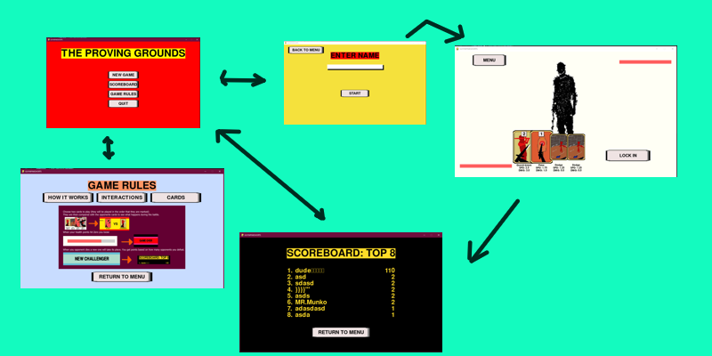

# Project Specification

## The applications purpose

The application would be a "En Garde" like game where the player battles the oponent using cards to decide the moves used (computer for now), the battle will be scored by the game based on health lost and number of moves used to win and elapsed time. There is a scoreboard displaying the 5 highest scores.

## Users
The application would not have different users apart from entering a score name when the game is over

## UserInterface 

The application has four different Views: Start menu, enter name prompt (before game starts), the game itself, a scoreboard and game rules.
 

## Functionalities 

- The player and the computer plays moves at the same time in a "rock-paper-scossor" manner
- Turnbased combat
- general gamelogic (cards, health, etc...)
- computer opponent
- animations and sound
- loading card data from a text filse so cards can quite easily be balanced
- scoreboard (saving it locally to a json file)