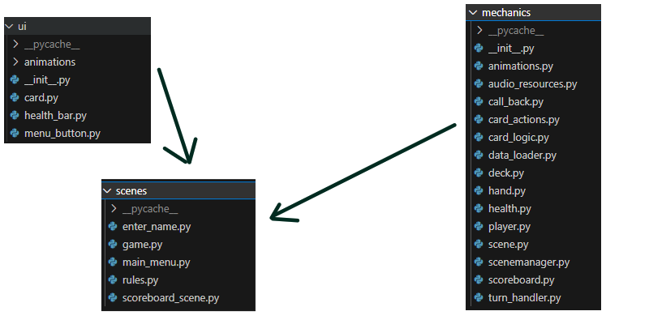

## Structure



## Class Structure


## Main funtions

### Turn Handling

#### Start of turn and card selection phase


#### combat phase
```mermaid
sequenceDiagram
  participant Turnhandler
  participant CardComparer
  participant AnimationHandler
  participant Deck
  Turnhandler->>Turnhandler: get_combat_data() 
  Turnhandler->>Turnhandler: self.state=2 
  Turnhandler->>CardComparer: self.card_comparer(cards and players) 
  note right
    this will happen twice since 2 cards are played per player each round
  end note
  Turnhandler->>CardComparer: self.get_faster_card()
  CardComparer->>Turnhandler: card_combat_data
  Turnhandler->>Turnhandler: if state is 2 and no animations are running
  Turnhandler->>Turnhandler: self.check_for_rounds()
  note right
    this will happen twice since 2 cards are played per player each round
  end note
  Turnhandler->>AnimationHandler: self.animation_handler.add_to_animation_queue(animation)
  Turnhandler->>Turnhandler: if len(self.combat_data)
  Turnhandler-->>Turnhandler: True
  Turnhandler-->>Turnhandler: self.state=3
  Turnhandler->>Turnhandler: if state is 3 and no animations are running
  Turnhandler->>Turnhandler: self.end_turn()

```