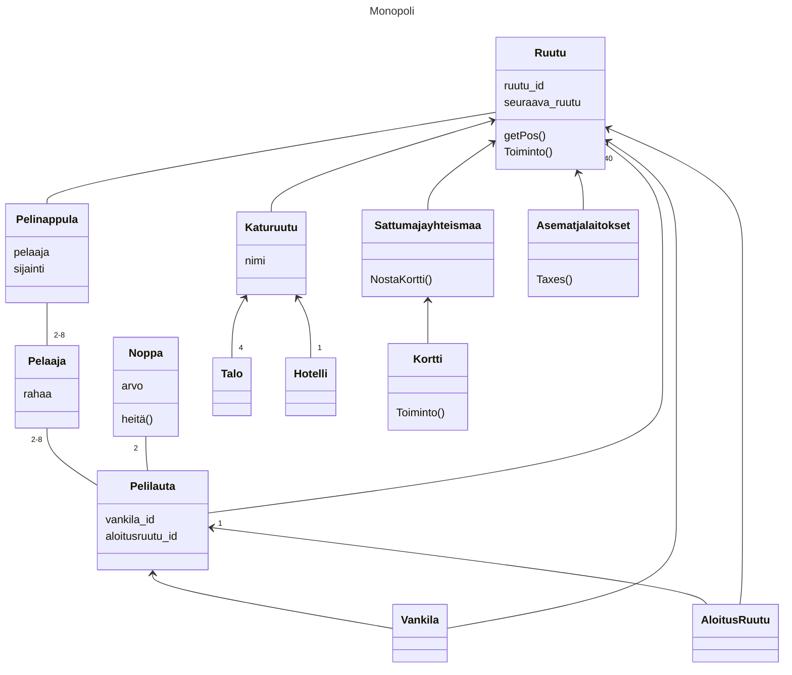

```mermaid
---
title: Monopoli
---
 classDiagram
      Pelaaja "2-8" --  Pelilauta
      Noppa "2" --  Pelilauta
      Pelinappula  -- "2-8" Pelaaja
      Ruutu "40" -- "1" Pelilauta
      Ruutu  --  Pelinappula
      Katuruutu <-- "4" Talo
      Katuruutu <-- "1" Hotelli

      Pelilauta <-- Vankila
      Pelilauta <-- AloitusRuutu
      Ruutu <-- Vankila
      Ruutu <-- AloitusRuutu
      Ruutu <-- Sattumajayhteismaa
      Ruutu <-- Asematjalaitokset
      Ruutu <-- Katuruutu

      Sattumajayhteismaa <-- Kortti

      class Noppa{
          arvo
          heitä()
      }
      class Pelaaja{
          rahaa
      }
      class Pelinappula{
          pelaaja
          sijainti
      }
      class Pelilauta{
          vankila_id
          aloitusruutu_id
      }
      class Ruutu{
          ruutu_id
          getPos()
          seuraava_ruutu
          Toiminto()
      }
      class Vankila{
      }
      class AloitusRuutu{
      }
      class Sattumajayhteismaa{
          NostaKortti()
      }
      class Asematjalaitokset {
        Taxes()
      }
      class Katuruutu{
        nimi
      }
      class Kortti{
        Toiminto()
      }
      class Talo{
      }
      class Hotelli{
      }
```
