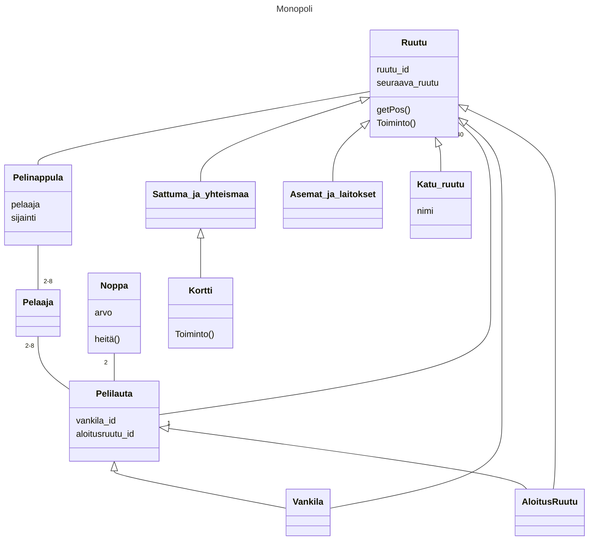

```mermaid
---
title: Monopoli
---
 classDiagram
      Pelaaja "2-8" --  Pelilauta
      Noppa "2" --  Pelilauta
      Pelinappula  -- "2-8" Pelaaja
      Ruutu "40" -- "1" Pelilauta
      Ruutu  --  Pelinappula


      Pelilauta <|-- Vankila
      Pelilauta <|-- AloitusRuutu
      Ruutu <|-- Vankila
      Ruutu <|-- AloitusRuutu
      Ruutu <|-- Sattuma_ja_yhteismaa
      Ruutu <|-- Asemat_ja_laitokset
      Ruutu <|-- Katu_ruutu

      Sattuma_ja_yhteismaa <|-- Kortti

      class Noppa{
          arvo
          heitä()
      }
      class Pelaaja{
      }
      class Pelinappula{
          pelaaja
          sijainti
      }
      class Pelilauta{
          vankila_id
          aloitusruutu_id
      }
      class Ruutu{
          ruutu_id
          getPos()
          seuraava_ruutu
          Toiminto()
      }
      class Vankila{}
      class AloitusRuutu{}
      class Sattuma_ja_yhteismaa{

      }
      class Asemat_ja_laitokset {

      }
      class Katu_ruutu{
        nimi
      }
      class Kortti{
        Toiminto()
      }
```
