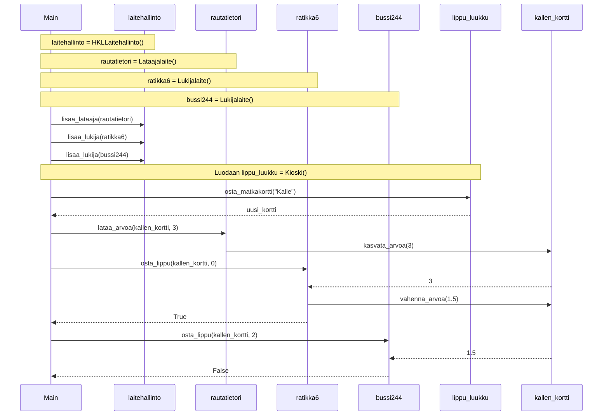

```mermaid
    sequenceDiagram
        Note over Main,laitehallinto:  laitehallinto = HKLLaitehallinto()
        Note over Main,rautatietori:  rautatietori = Lataajalaite()
        Note over Main,ratikka6:  ratikka6 = Lukijalaite()
        Note over Main,bussi244:  bussi244 = Lukijalaite()

        Main->>laitehallinto: lisaa_lataaja(rautatietori)
        Main->>laitehallinto: lisaa_lukija(ratikka6)
        Main->>laitehallinto: lisaa_lukija(bussi244)

        Note over Main,lippu_luukku: Luodaan lippu_luukku = Kioski()

        Main->>lippu_luukku: osta_matkakortti("Kalle")
        lippu_luukku-->>Main: uusi_kortti
        Main->>rautatietori: lataa_arvoa(kallen_kortti, 3)
        rautatietori->>kallen_kortti: kasvata_arvoa(3)
        Main->>ratikka6: osta_lippu(kallen_kortti, 0)
        kallen_kortti-->>ratikka6: 3
        ratikka6->>kallen_kortti: vahenna_arvoa(1.5)
        ratikka6-->>Main: True
        Main->>bussi244: osta_lippu(kallen_kortti, 2)
        kallen_kortti-->>bussi244: 1.5
        bussi244-->>Main: False
        
```