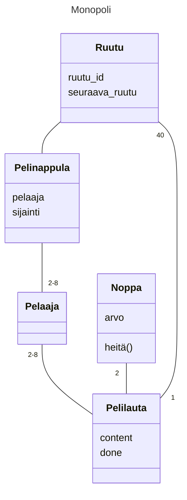

```mermaid
---
title: Monopoli
---
 classDiagram
      Pelaaja "2-8" --  Pelilauta
      Noppa "2" --  Pelilauta
      Pelinappula  -- "2-8" Pelaaja
      Ruutu "40" -- "1" Pelilauta
      Ruutu  --  Pelinappula


      class Noppa{
          arvo
          heitä()
      }
      class Pelaaja{
      }
      class Pelinappula{
          pelaaja
          sijainti
      }
      class Pelilauta{
          content
          done
      }
      class Ruutu{
          ruutu_id
          seuraava_ruutu
      }
```
