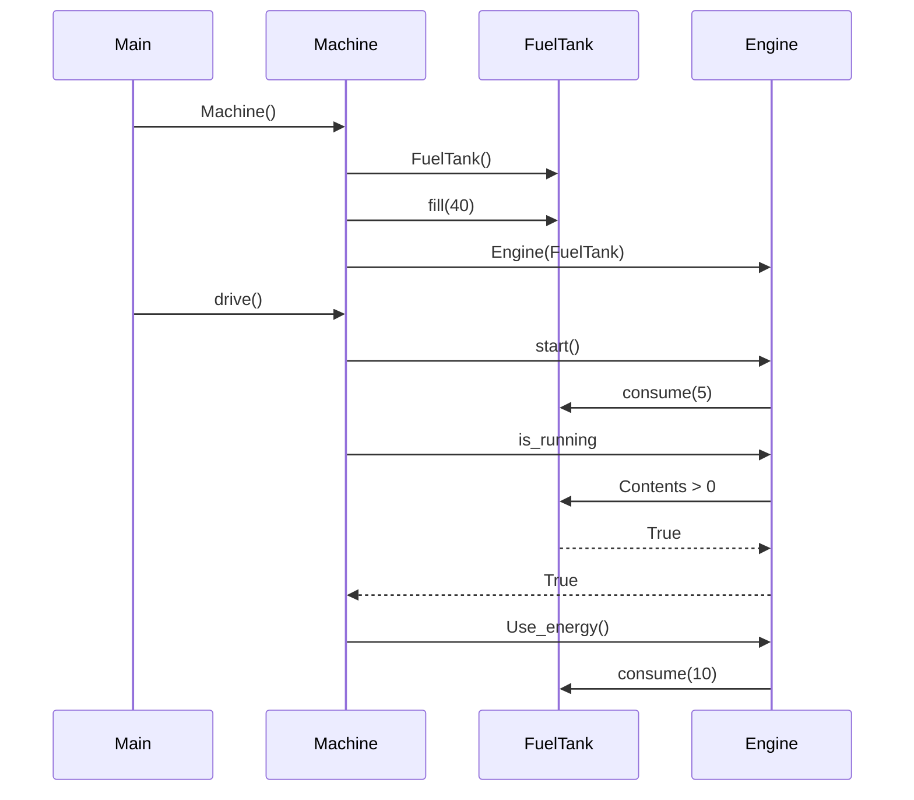

```mermaid
    sequenceDiagram
        Main->>Machine: Machine()
        Machine->>FuelTank: FuelTank()
        Machine->>FuelTank: fill(40)
        Machine->>Engine: Engine(FuelTank)
        Main->>Machine: drive()
        Machine->>Engine: start()
        Engine->>FuelTank: consume(5)
        Machine->>Engine: is_running
        Engine->> FuelTank:Contents > 0
        FuelTank-->>Engine: True
        Engine-->>Machine: True
        Machine->>Engine: Use_energy()
        Engine->>FuelTank: consume(10)    
```
